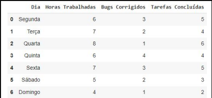
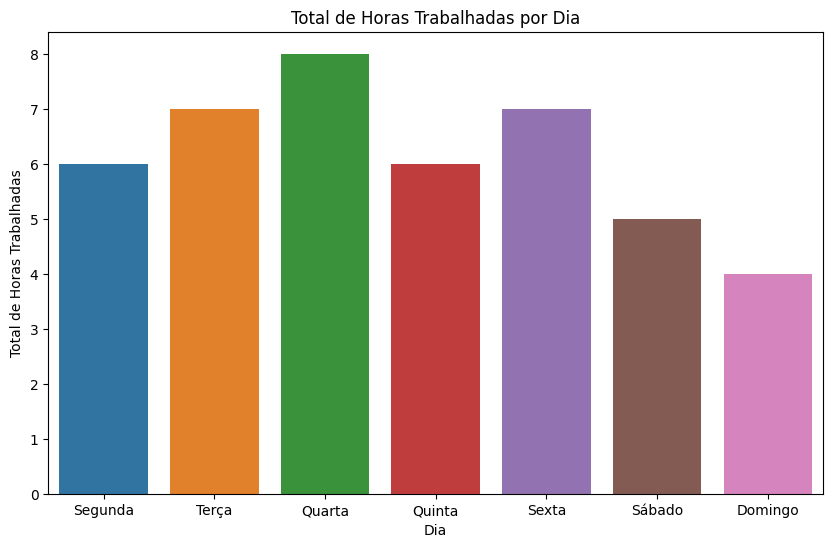
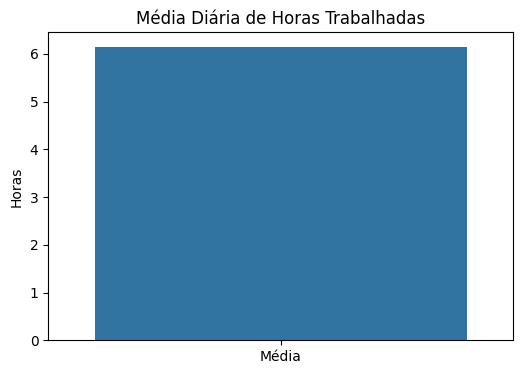
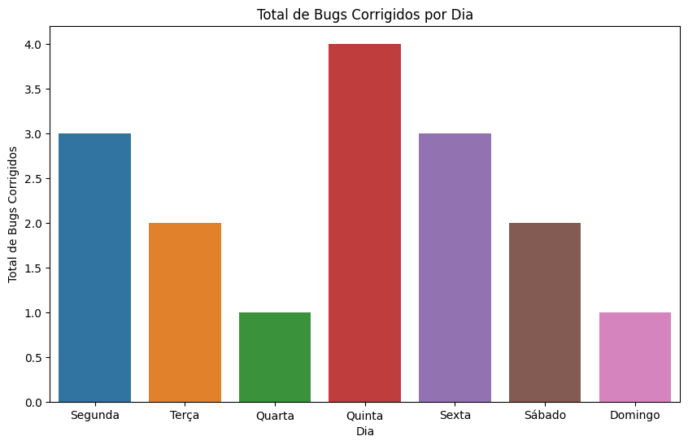
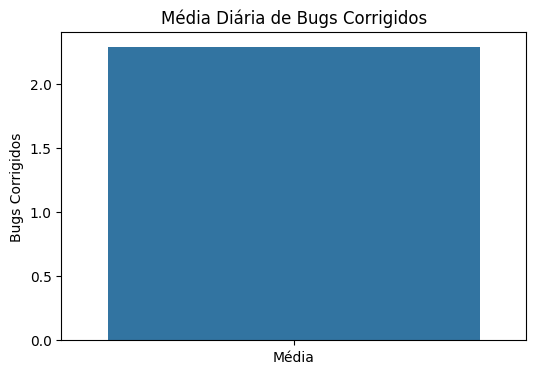
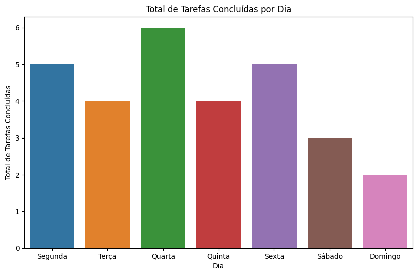
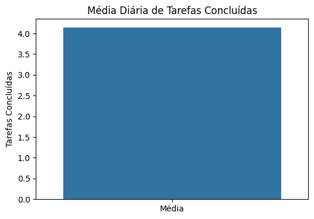

# Modulo-4_Relatorios-de-Progresso

# Relatório de Progresso Diário

Este relatório apresenta o progresso diário do trabalho dos funcionários em uma empresa de desenvolvimento de softwares. Abaixo estão as métricas calculadas e os gráficos correspondentes para cada uma das questões solicitadas.

## Base de Dados

## Métricas

- Total de Horas Trabalhadas: 43 horas
- Média Diária de Horas Trabalhadas: 6.14 horas
- Total de Bugs Corrigidos: 16
- Média Diária de Bugs Corrigidos: 2.29
- Total de Tarefas Concluídas: 29
- Média Diária de Tarefas Concluídas: 4.14

## Gráfico - Total de Horas Trabalhadas por Dia

## Gráfico - Média Diária de Horas Trabalhadas

## Gráfico - Total de Bugs Corrigidos por Dia

## Gráfico - Média Diária de Bugs Corrigidos

## Gráfico - Total de Tarefas Concluídas por Dia

## Gráfico - Média Diária de Tarefas Concluídas

## Gráfico - Produtividade Diária (Tarefas Concluídas por Hora)

